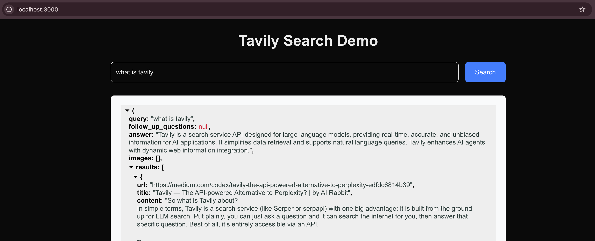

# Tavily Search Demo



A modern web application that demonstrates the usage of Tavily's AI search API with a beautiful JSON results viewer. This application allows you to perform advanced searches and displays results with AI-generated answers in a well-formatted JSON view.

## Features

- Clean and modern user interface
- Real-time search using Tavily API with advanced search depth
- Beautiful JSON formatting of search results
- Comprehensive error handling and loading states
- AI-generated answers for search queries
- Responsive design for all devices
- TypeScript for better type safety

## Prerequisites

- Node.js 18.18.0 or higher
- A Tavily API key (get one at [Tavily's website](https://tavily.com))
- npm or yarn package manager

## Setup

1. Clone the repository:
   ```bash
   git clone <repository-url>
   cd tavily-search-demo
   ```

2. Install dependencies:
   ```bash
   npm install
   ```

3. Create a `.env.local` file in the root directory and add your Tavily API key:
   ```
   TAVILY_API_KEY=tvly-YOUR_API_KEY_HERE
   ```
   Note: Make sure your API key starts with "tvly-". If it doesn't, please check your Tavily dashboard for the correct key.

4. Start the development server:
   ```bash
   npm run dev
   ```

5. Open [http://localhost:3000](http://localhost:3000) in your browser

## Usage

1. Enter your search query in the input field
2. Press Enter or click the Search button
3. View the beautifully formatted JSON results below
4. The results include:
   - An AI-generated answer to your query
   - Relevant search results with URLs and content
   - Relevance scores for each result
   - Response time information

## Error Handling

The application handles various API-related errors:
- Invalid API key errors
- Rate limiting
- Insufficient credits
- Service availability issues
- Network errors

## Technologies Used

- Next.js 14
- TypeScript
- Tailwind CSS
- React JSON View Lite
- Tavily Search API

## API Rate Limits and Credits

Please be aware of Tavily's API limitations:
- Each search request consumes API credits
- Advanced searches use more credits than basic searches
- There are rate limits on API calls
- Check your Tavily dashboard for your current credit balance

## Development

To modify the application:
- Frontend code is in `src/app/page.tsx`
- API endpoint is in `src/app/api/search/route.ts`
- Styles are managed through Tailwind CSS classes

## Troubleshooting

If you encounter issues:
1. Verify your API key is correctly set in `.env.local`
2. Ensure your API key starts with "tvly-"
3. Check your Tavily dashboard for available credits
4. Make sure you're running Node.js 18.18.0 or higher
5. Clear your browser cache if you see stale results

## Contributing

Contributions are welcome! Please feel free to submit a Pull Request.

## License

MIT
